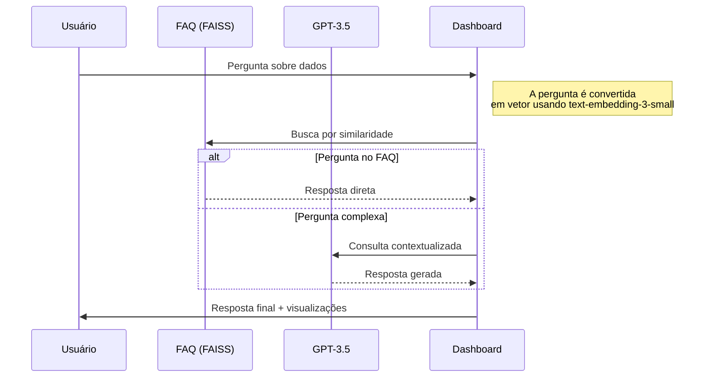

# 🌐 Dashboard Interativo de Conectividade Escolar com Chatbot Analítico

Um dashboard completo para análise da infraestrutura digital nas escolas de São Paulo, combinando visualização de dados avançada com um chatbot especializado em educação digital.

## 🚀 Acesso Online
**Aplicação Publicada:**  
https://dashboard-chatbot-v2-887647441176.southamerica-east1.run.app

## ✨ Principais Funcionalidades

### 🗺️ Visualização Geográfica Avançada
- **Mapa de Escolas**: Visualização interativa com marcadores dimensionados por velocidade de internet
- **Mapa de Distritos**: Heatmap por desempenho médio com tooltips informativos
- **Sistema de Camadas**: Ative/desative categorias de velocidade (Muito Baixa, Baixa, Média, Alta)
- **Tema Adaptável**: Alternância entre modo claro e escuro

### 📊 Análise de Dados Integrada
- **Velocímetros Comparativos**: Média das escolas vs média dos distritos
- **Gráfico de Dispersão**: Relação entre IDEB e velocidade de internet
- **Filtros Dinâmicos**: Conexão entre todos os widgets de seleção
- **Tabela Interativa**: Ranking de distritos com barra de progresso

### 🤖 Chatbot com RAG Especializado
- **FAQ Estruturado**: Base de conhecimento sobre infraestrutura escolar
- **Busca Semântica**: Encontra perguntas similares usando embeddings
- **Respostas Híbridas**: Combina FAQ com GPT-3.5 para cobertura completa
- **Contexto Educacional**: Especializado em conectividade e IDEB

## 💡 Como Utilizar

### 1. Explorando os Dados
- Use os filtros na barra lateral para selecionar:
  - Faixa de velocidade (1-100Mbps)
  - Categorias de conectividade
  - Regiões (DRE, Subprefeitura, Distrito)
  - Tipo de escola e bairros

### 2. Interação com Visualizações
- **Clique nos marcadores** para ver detalhes das escolas
- **Passe o mouse** nos distritos para métricas regionais
- **Compare velocímetros** para análise relacional

### 3. Consultando o Chatbot
Exemplos de perguntas:
- "Quais escolas na zona leste têm internet abaixo de 10Mbps?"
- "Como a velocidade da internet se relaciona com o IDEB?"
- "Mostre distritos com melhor infraestrutura digital"
- "Quais políticas públicas existem para melhorar a conectividade?"

## ⚙️ Arquitetura e Fluxo Operacional

### 🔄 Fluxo do Chatbot (RAG + GPT-3.5)

---
## 🛠️ Melhorias Técnicas Implementadas

### ⚡ Otimizações de Performance
- **Cache de Embeddings**: Evita reprocessamento de perguntas similares  
  → *Reduz chamadas redundantes à API da OpenAI*
- **Particionamento do FAQ**: Agrupamento por tópicos para buscas eficientes  
  → *Organização semântica usando FAISS*
- **Streamlit Cache**: Armazenamento local de dados processados  
  → `@st.cache_data` para datasets e `@st.cache_resource` para modelos

| Função Principal       | Sub-elementos               |
|------------------------|-----------------------------|
| Visualização Temporal  | • Linha do tempo • Heatmap evolutivo |
| Comparação de Redes    | • Pública vs Privada        |

## 🔧 Sugestões de Melhorias Futuras
### 🚀 Performance
- Converter CSV para Parquet (reduzir tempo de carga em ~40%)
- Implementar pré-computação de agregados estatísticos
- Adicionar cache distribuído para embeddings

### 📊 Análise de Dados
- Incluir visualização temporal da evolução da conectividade
- Adicionar comparação entre redes pública e privada
### 🤖 Chatbot
- Adicionar capacidade de gerar visualizações sob demanda
- Implementar feedback para aprimoramento contínuo do FAQ
- Adicionar exemplos de perguntas na interface

